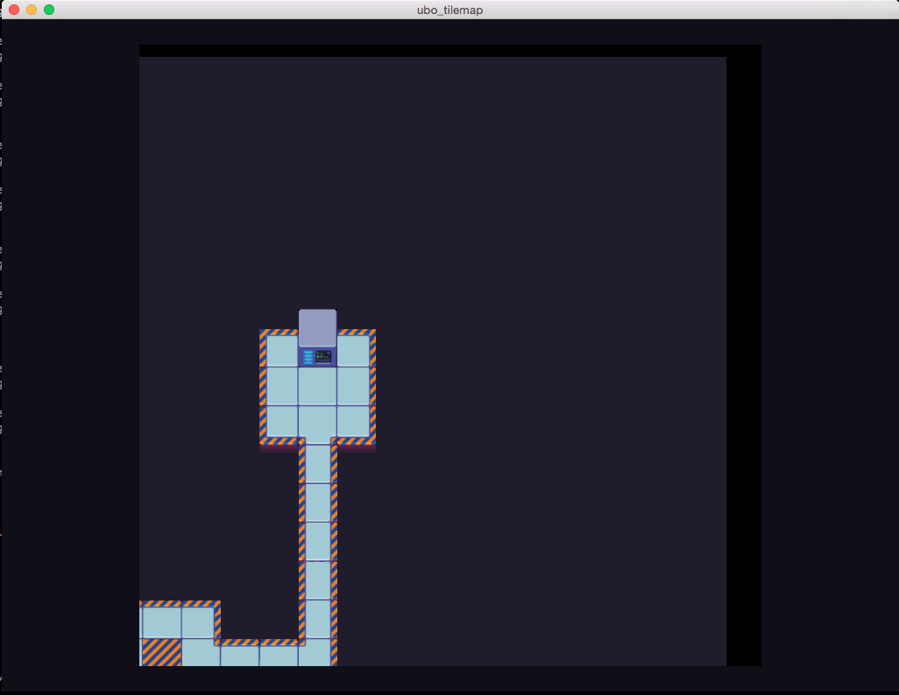

<!--
    Copyright 2015 The Gfx-rs Developers.

    Licensed under the Apache License, Version 2.0 (the "License");
    you may not use this file except in compliance with the License.
    You may obtain a copy of the License at

        http://www.apache.org/licenses/LICENSE-2.0

    Unless required by applicable law or agreed to in writing, software
    distributed under the License is distributed on an "AS IS" BASIS,
    WITHOUT WARRANTIES OR CONDITIONS OF ANY KIND, either express or implied.
    See the License for the specific language governing permissions and
    limitations under the License.
-->

# UBO-based Tilemap Example

This example shows a shader-driven, Uniform Buffer Object (UBO)-backed scrolling tilemap, akin to what is seen in 2D, tile-based games. The tiles are rendered on a single OpenGL plane mesh, with each vertex referencing data in a UBO. The contents of the UBO are updated, as the user "scrolls" around the tilemap, with fragment shader logic determining it's current tile and appropriate offset, which is used to discover the fragment color to be displayed. As a bonus, basic lighting formation is also contained in the UBO data.

Whenever there is a non-zero "offset" (as the display of the tilemap is between edges), there will be a black gap on the right/upper-most portions of the tilemap. This is because those portions of the tilemap would display tiles that are outside of the bounds of the current UBO collection. Presumably, the tilemap mesh would be zoomed in upon so that those border tiles are outside of the current view.

The plane can be zoomed in/out with `+` and `-`. The camera can be moved in space via the arrow keys. The contents of the tilemap can be "scrolled" with the `W` (up), `S` (down), `A` (left) and `D` (right) keys.

## Tilesheet Information

The provided `scifitiles-sheet_0.png` was created by [Michele Bucelli (aka Buch)](https://www.patreon.com/buch?ty=h) and is [Public Domain](http://opengameart.org/content/sci-fi-interior-tiles).

## Screenshot

